# 学习总结

## JVM

### 1.1 JVM架构

JVM包含两个子系统和两个组件，两个子系统为Class loader(类装载)、Execution engine(执行引擎)；两个组件为Runtime data area(运行时数据区)、Native Interface(本地接口)。

Class loader(类装载)：根据给定的全限定名类名(如：java.lang.Object)来装载class文件到Runtime data area中的method area。

Execution engine（执行引擎）：执行classes中的指令。

Native Interface(本地接口)：与native libraries交互，是其它编程语言交互的接口。

Runtime data area(运行时数据区域)：就是常说的JVM的内存。

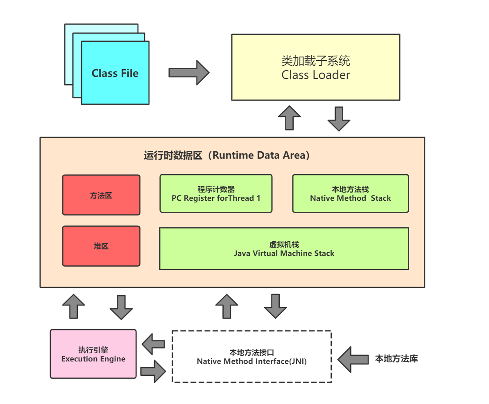

### 1.2 JVM调优

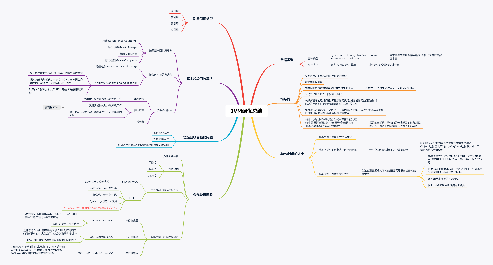

## NIO

NIO这块说实话，确实没有搞懂，但感觉是为了解决传统IO网络传输性能慢的问题，IO是面向流的处理，NIO是面向块(缓冲区)的处理，面向流的I/O 系统一次一个字节地处理数据，一个面向块(缓冲区)的I/O系统以块的形式处理数据，区别如下：

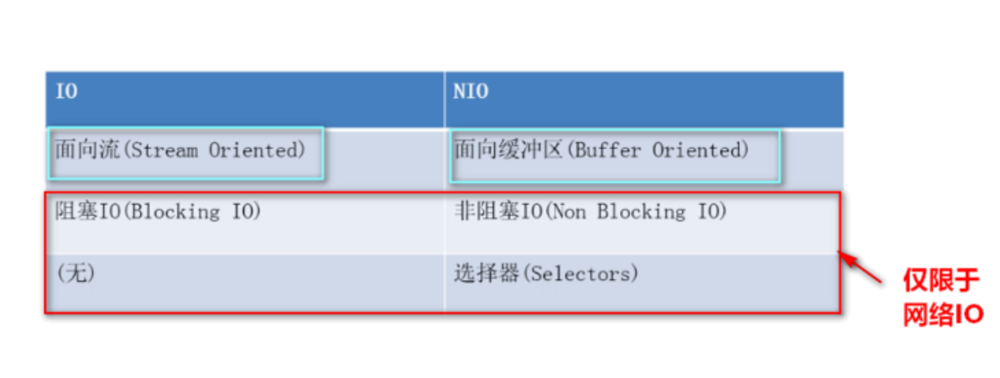

NIO主要有**三个核心部分组成**：

- **buffer缓冲区**
- **Channel管道**
- **Selector选择器**

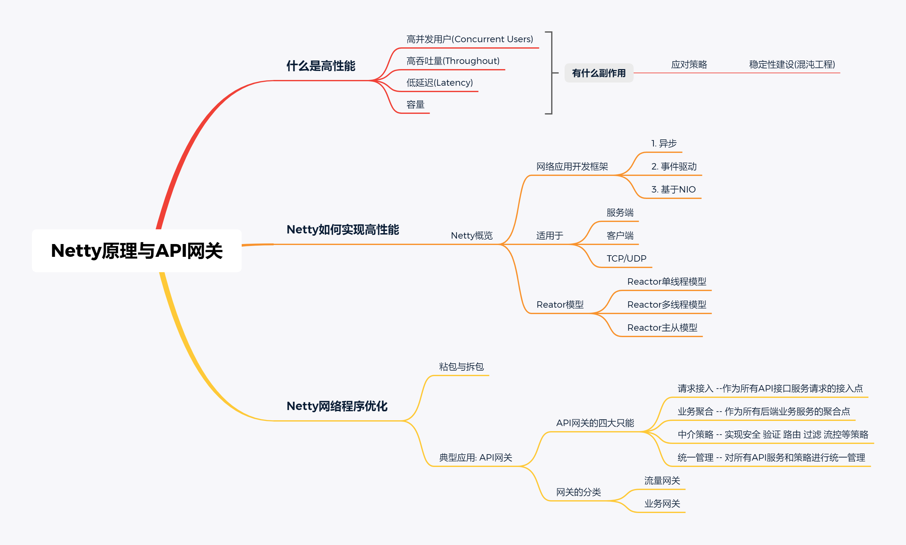

## 并发编程

平时工作中，并发用的还是比较多的，特别是多线程写数据到数据库时，很容易在多并发时，出现锁表的情况，解决这个问题，一般一是注意数据库的事务隔离级别设置为RC，二是在入库时把数据按大小或条数拆分成一批一批，分批入库，并增加异常捕获和重试机制，三是给表添加主键或者唯一索引，保障入库的数据不要重复。

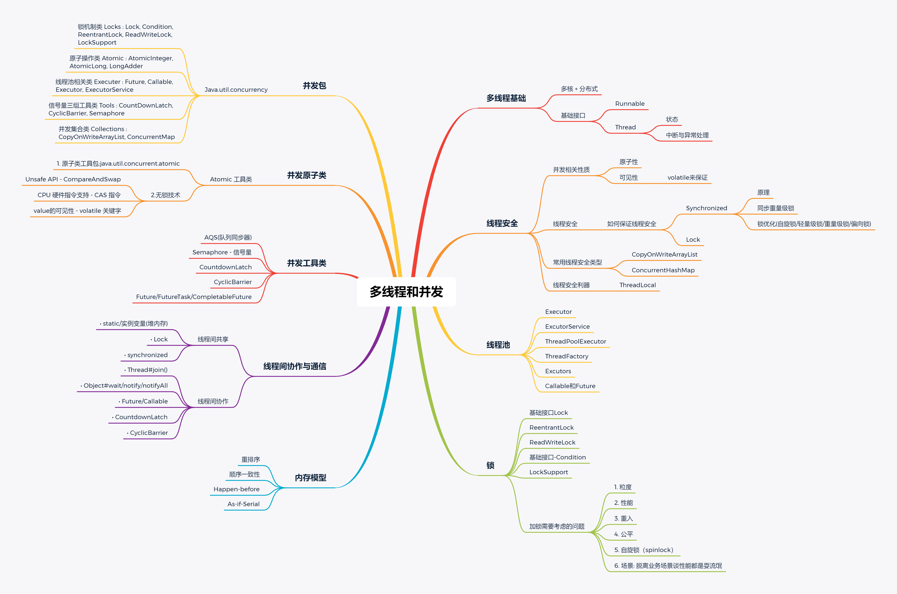

## Spring 和 ORM 等框架

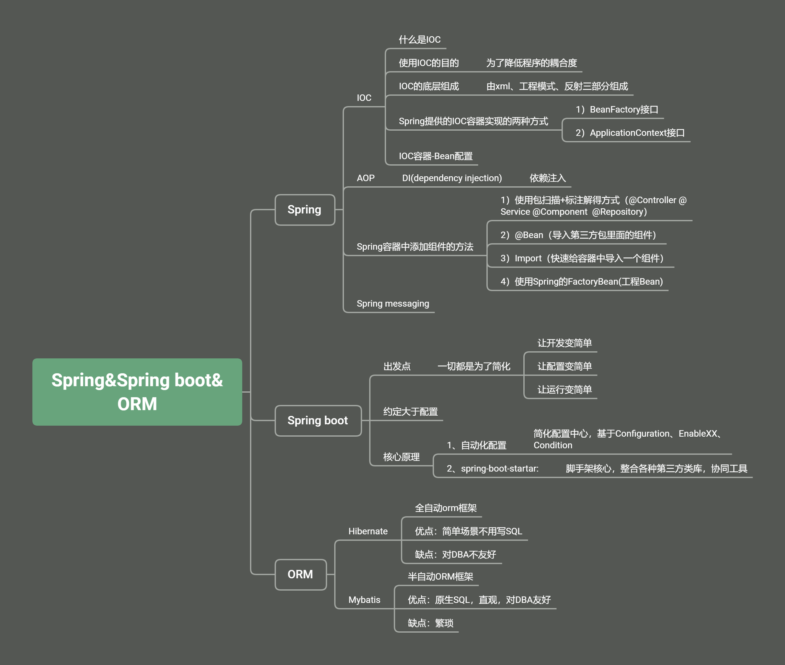

## MySQL 数据库和 SQL

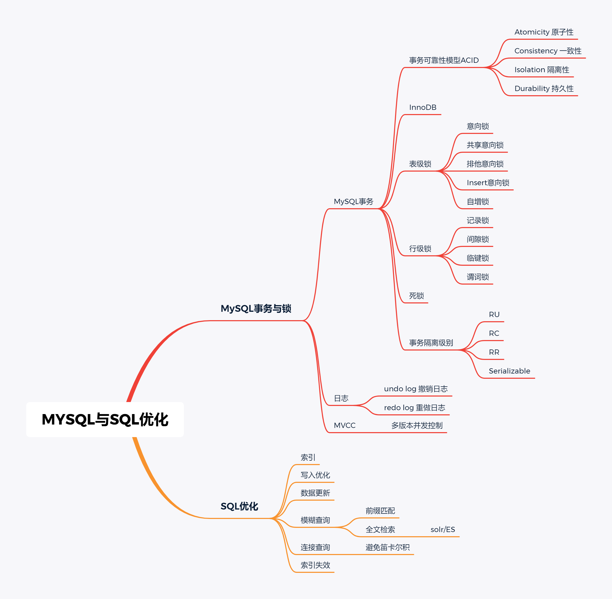

## 分库分表

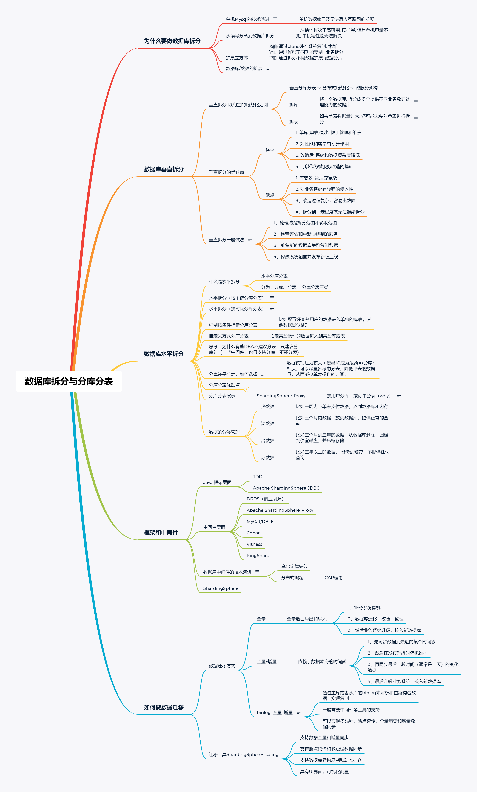

## RPC 和微服务

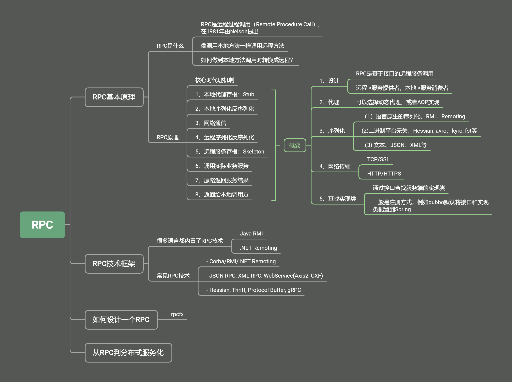

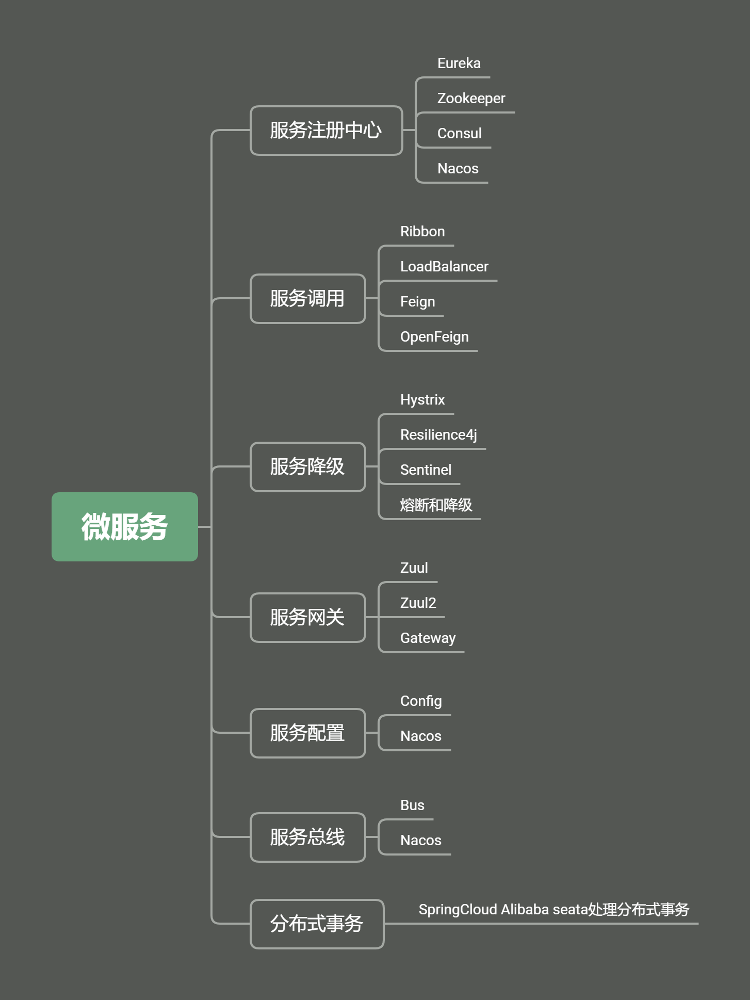

## 分布式缓存

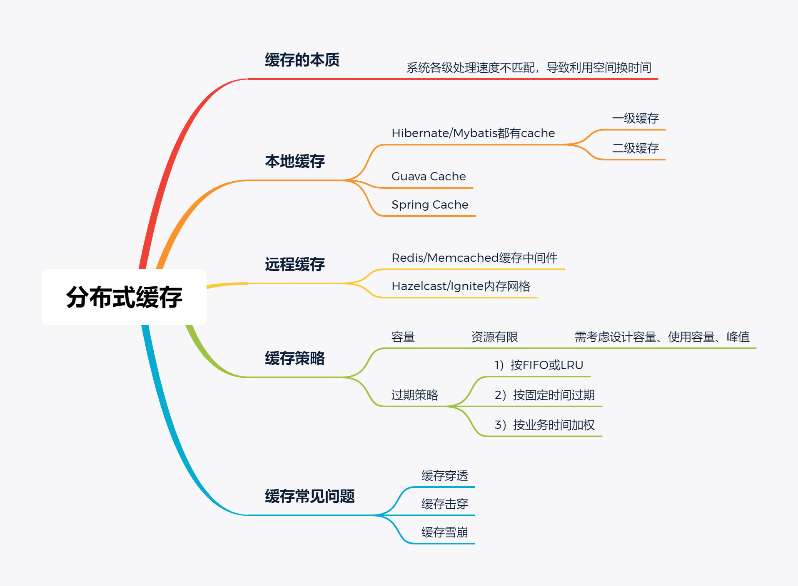

## 分布式消息队列

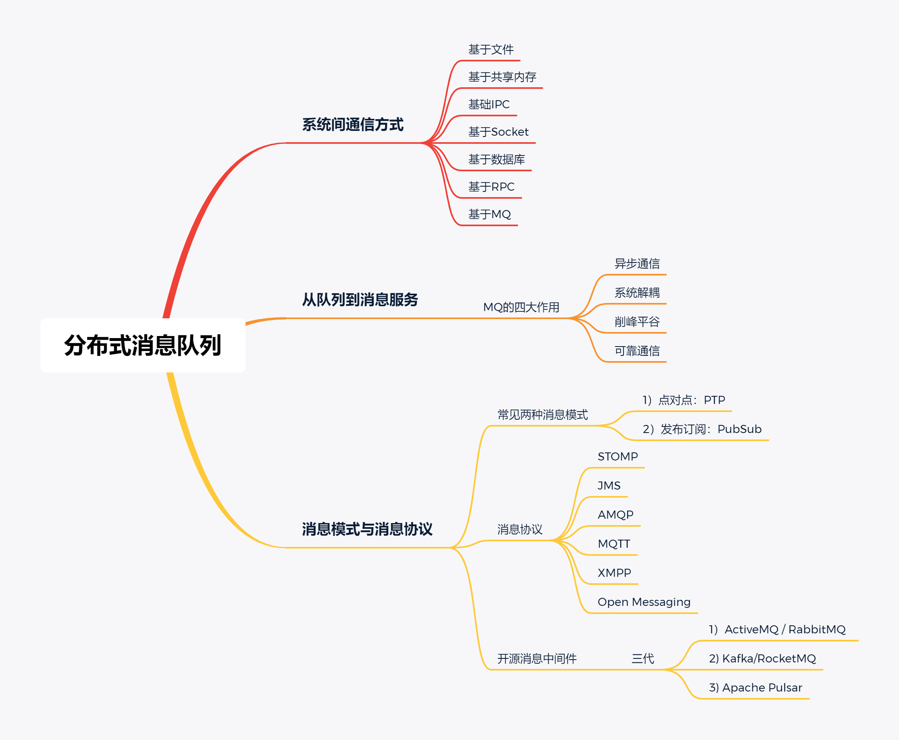